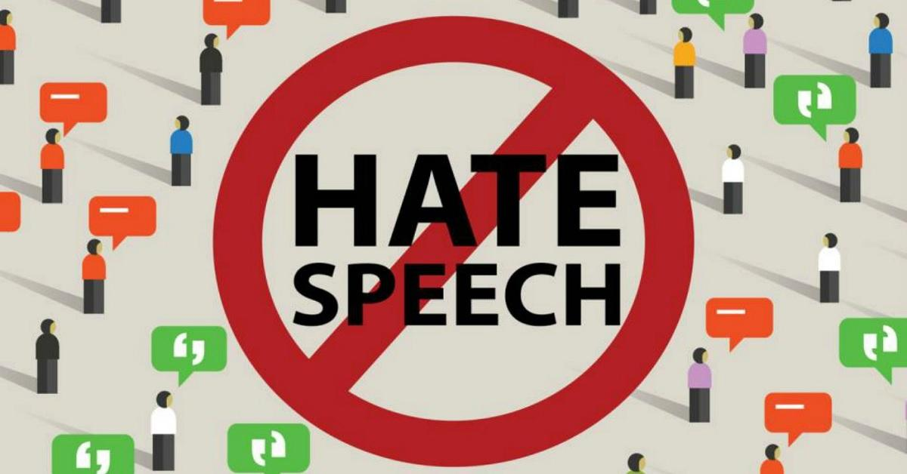

# Multi-Modal Hate Speech Detection (Perspective API)




> A modern, multi-modal hate speech detection web app using the [Perspective API](https://perspectiveapi.com/). Analyze text, images, audio, and video for toxic or harmful content in a user-friendly interface.

## What is Hate Speech Detection?

Hate speech detection is the process of identifying and flagging content that is toxic, offensive, or harmful. This project leverages the Perspective API to analyze content for various toxicity attributes, supporting multiple input types (text, image, audio, video) by extracting text and running it through the API.

## 🚀 Key Features

### 🧠 Multi-Modal Detection
- **Text Analysis** 📝 — Detect hate speech in plain text.
- **Image Analysis** 🖼️ — Extract text from images (OCR) and analyze for toxicity.
- **Audio Analysis** 🔊 — Convert speech to text and analyze for hate speech.
- **Video Analysis** 🎥 — Extract audio, transcribe speech, and analyze for toxicity.

### 📊 Detailed Toxicity Analysis
- Analyze multiple attributes using the Perspective API:
  - **Toxicity** 🚫
  - **Insult** 😠
  - **Profanity** 💢
  - **Threat** ⚔️
  - **Identity Attack** 👥
  - **Sexually Explicit** 🔞
  - **Obscene** 🚯
  - **Flirtation** 💝
  - **Spam** 📧
- Visualize results with interactive charts and progress bars.

### 📥 Downloadable PDF Reports
- Generate and download a comprehensive PDF report of your analysis.

### 🗣️ User Feedback
- Submit feedback on analysis results to help improve the system.

---

## 💻 Prerequisites

- Python 3.8+
- Streamlit
- Perspective API key (add to `.env` as `PERSPECTIVE_API_KEY`)
- Tesseract OCR (for image text extraction)
- ffmpeg (for audio/video processing)

## 🔑 Getting a Perspective API Key

To use this app, you need a free API key from Perspective:

1. Go to the [Perspective API Access Request page](https://perspectiveapi.com/#/access).
2. Sign in with your Google account and fill out the form.
3. Once approved, copy your API key and add it to your `.env` file as:
   ```env
   PERSPECTIVE_API_KEY=your_api_key_here
   ```

## 🚀 Installation

1. Clone the repository:
```bash
git clone https://github.com/rahul-jaiswar-git/Toxic-Content-Analyzer-with-Perspective-API.git
cd Toxic-Content-Analyzer-with-Perspective-API
```

2. Install dependencies:
```bash
pip install -r requirements.txt
```

3. Add your Perspective API key to a `.env` file:
```env
PERSPECTIVE_API_KEY=your_api_key_here
```

4. (Optional) Install Tesseract and ffmpeg if you want image/audio/video support.

5. Run the application:
```bash
streamlit run src/app.py
```

## ☕ Usage

- Enter or upload text, image, audio, or video in the web interface.
- The app will extract text (if needed) and analyze it using the Perspective API.
- View detailed toxicity scores, download a PDF report, and provide feedback.

## 🛠️ Technology Stack

- **Frontend/UI**: Streamlit
- **Backend**: Python
- **API**: Perspective API (Google)
- **Text Extraction**: pytesseract, speech_recognition, moviepy
- **PDF Reports**: reportlab

## 🏗️ File Structure

```
project/
├── src/
│   ├── app.py                # Main Streamlit app
│   ├── styles.css            # UI styling
│   └── test_api.py           # Perspective API attribute tester
├── resources/                # Resource files (images, audio, gifs)
│   ├── Hate.jpg
│   ├── models.gif
│   ├── about us.gif
│   ├── audio.wav
│   └── testaudio
├── .devcontainer/            # Dev container config (optional)
│   └── devcontainer.json
├── requirements.txt          # Python dependencies
└── README.md                 # Project documentation
```

## 🤝 Contributors

<table>
  <tr>
    <td align="center">
      <a href="https://github.com/rahul-jaiswar-git" title="Rahul Jaiswar">
        <br>
        <sub>
          <b>Rahul Jaiswar</b>
        </sub>
      </a>
    </td>
  </tr>
</table>

## 📝 License

This project is licensed under the MIT License - see the [LICENSE](LICENSE) file for details.

## 📢 Project Note

This project is an extension and evolution of the original [Hate-Shield-AI](https://github.com/rahul-jaiswar-git/Hate-Shield-AI) repository. While the original project focused on multi-modal hate speech detection for Hinglish using deep learning, this project aims to push the boundaries further by implementing a more modern, SaaS-ready, and user-friendly approach. It leverages the Perspective API for scalable, real-time toxicity analysis across text, images, audio, and video, and introduces enhanced reporting, feedback, and analytics features for a next-generation content moderation experience. 